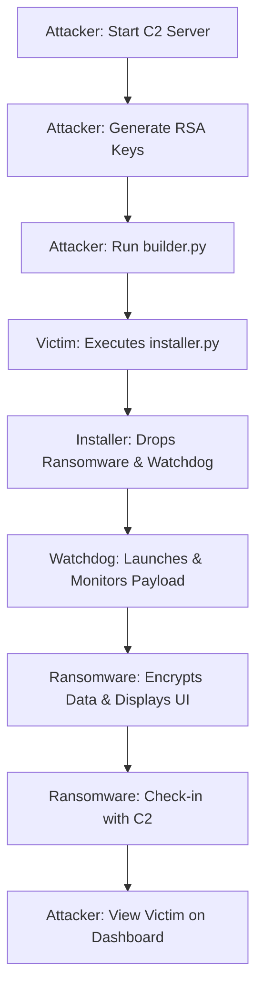

# Cerberus Ransomware Simulation 🐕🔥

> **⚠️ DISCLAIMER: FOR EDUCATIONAL AND RESEARCH PURPOSES ONLY.**
> This project is a controlled simulation designed to demonstrate malware mechanics, C2 infrastructure, and defensive concepts. **Unauthorized use on systems you do not own is strictly prohibited and likely illegal.**

---

## 📖 Overview

**Cerberus** is a sophisticated, end-to-end ransomware simulation framework. It demonstrates the lifecycle of a modern cyber-attack, from the initial delivery via a "Trojaned" installer to persistent system lockdown and remote command-and-control (C2) management.

### What is it?
A full-stack implementation of a ransomware attack:
- **Attacker Side**: A Flask-based C2 Server with a live dashboard and RSA-based decryption management.
- **Victim Side**: A multi-stage payload featuring a fake NVIDIA installer, a watchdog monitor, and a high-security encryption engine.

---

## 🏗️ Technical Architecture

The project is structured into two main workspaces: `attacker` and `victim`.

### 1. The Infection Lifecycle

### 2. Core Components

#### 🕵️ C2 Server (`attacker/c2_server.py`)
The "brain" of the operation.
- **RSA Key Management**: Generates a 2048-bit RSA pair. The Public Key is embedded in the payload, while the Private Key never leaves the server.
- **Victim Dashboard**: A web interface tracking IP addresses, infection status, and a **Server-Side Doomsday Timer**.
- **Remote Operations**: Allows the attacker to adjust timers, send custom commands, or release the decryption key once "paid."

#### 📦 Dropper/Installer (`victim/installer.py`)
A social engineering masterpiece.
- **The Trojan**: Mimics a legitimate **NVIDIA GeForce Driver Installer**.
- **Dual Payload**: Silently extracts and drops `ransomware.py` and `watchdog.py` while the user watches a convincing progress bar.

#### 🐕 Watchdog (`victim/watchdog.py`)
The persistence layer.
- **Resilience**: Constantly monitors the ransomware process. If the user kills the ransomware task, the watchdog instantly respawns it.
- **Cleanup Coordination**: Waits for a "stop signal" from the ransomware (triggered by valid decryption) to perform a self-destruct sequence.

#### 💀 Ransomware Payload (`victim/ransomware.py`)
The main execution engine.
- **Cryptography**: Uses **AES-256-GCM** for high-speed file encryption. The AES key is unique to the session and is sent to the C2 encrypted with the **RSA-2048** Public Key.
- **System Lockdown**:
    - **Focus Enforcement**: Forces the GUI to the top every 50ms.
    - **Input Blocking**: Disables system shortcuts (Alt+F4, Esc) and steals mouse focus.
    - **Watchdog Integration**: Automatically installs itself into system startup Registry/Paths.
- **Psychological Components**:
    - **Ragebait UI**: Trolls the user with mocking messages on exit attempts.
    - **Voice Synthesis (TTS)**: Announces threats ("System failure imminent") through the system speakers every 30 seconds.

---

## 🔐 Cryptography Deep-Dive

Cerberus follows industry standards for secure key exchange:

1.  **Preparation**: Attacker generates RSA-2048 keys.
2.  **Encryption**: On the victim machine, a random **256-bit AES key** is generated. All target files are encrypted using **AES-256-GCM** (authenticated encryption).
3.  **Key Transport**: The AES key is encrypted using the **Attacker's RSA Public Key**. Even if the victim discovers the encrypted key file, it cannot be decrypted without the Attacker's Private Key.
4.  **Decryption**: Once the C2 releases the key, the victim receives the AES key, validates it, and reverses the encryption process.

---

## 🚀 Setup & Usage

### Step 1: Start the C2 (Attacker)
Go to the `attacker/` directory, install dependencies, and run the server. Note the **Public Key** printed in the console.

### Step 2: Build the Dropper (Victim/Builder)
Run `builder.py`. It will ask for the C2 IP and automatically inject the Public Key into a new `installer.py` dropper.

### Step 3: Deployment
Execute `installer.py` on the target machine. Observe the fake installation progress followed by the system lockdown.

### Step 4: Management
Access the dashboard at `http://[C2_IP]:5000` to manage your victims and release keys.

---

## 🛡️ Defensive & Safety Measures

To ensure this tool remains a safe educational resource:
- **Target Restriction**: By default, it ONLY encrypts files in `~/test_data`.
- **Offline Mode**: If the C2 is unreachable, the UI provides a "local test" path.
- **Clean Exit**: Successful decryption removes all persistence, watchdog files, and self-deletes the malware code.

---
